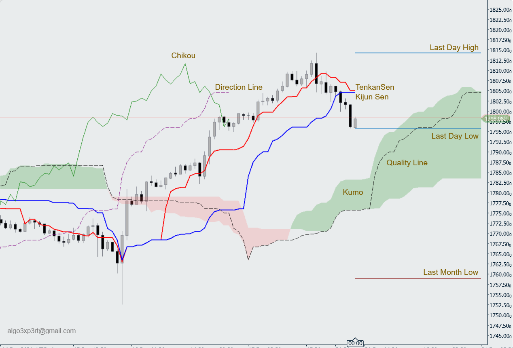

## Jepsian (Custom Ichimoku Indicator)

As you know in the original Ichimoku indicator it is possible to change Tenkan-sen, Kijun-sen, and Senkou calculation range. In reality, When you are changing the default values,  you are changing the foundation of logic behind the tools and you are breaking the relationship between time series and price-action interpretation. So when you want to change default values, it may be a nice idea to change the shift of elements that the original Ichimoku indicator doesn't let you do it.

Jepsian is here to let you have full control over the original Ichimoku. With this indicator, you can change the calculation range and shift the elements to where the suit of your analyzing style is. In addition, with Jepsian you have two extra curves that are usable for some special conformation and analyzing.

Have pay attention all the curves in Jepsian are customizable and you can change the visual side to what you want or disable them.

### Installation:

Just copy the indicator(Jepsian.algo) from Info Jepsian Directory to your PC and double-click on it. It will install automatically on your Ctrader-Platform. You can also download it directly from the Ctrader network:      

